# WasmMakie.jl

**Makie's plotting API, rendered through HTML Canvas2D, compiled to WebAssembly.**

WasmMakie gives you Makie's exact user-facing API — `Figure`, `Axis`, `lines!`, `scatter!`,
`heatmap!`, themes, layouts — with all plotting logic (tick finding, layout solving, color
mapping, text layout, rendering) running as a WasmGC module in the browser, compiled from
Julia by [WasmTarget.jl](https://github.com/GroupTherapyOrg/WasmTarget.jl). No Julia server,
no precomputed state.

## The acid test

A plain HTML file with a `<canvas>`, the compiled wasm module, and the glue JS shows a plot.
No framework anywhere. That is the standing definition of "self-contained" for this package —
any notebook system or web framework that can render `text/html` (or wire wasm imports) gets
working plots, but none of them are referenced by this package.

```julia
using WasmMakie

fig = Figure(size = (400, 300))
ax = Axis(fig[1, 1]; title = "sine")
lines!(ax, collect(0:0.1:10), sin)
fig   # show(io, MIME"text/html", fig) → SELF-CONTAINED fragment: canvas +
      # glue + bundled fonts + recorded command stream + replayer. Works in
      # any notebook/docs system that honors the HTML MIME. Or explicitly:

write("plot.html", "<!doctype html><html><body>" * html_snippet(fig) * "</body></html>")
# → open plot.html in any browser. No server, no framework, no requests.
```

For interactive islands (stateless recompute), the HOST compiles a figure
kernel with WasmTarget and wraps the module:

```julia
# host side (e.g. Therapy/PlutoIslands build step) — WasmMakie itself never compiles
bytes = WasmTarget.compile_multi([(my_figure_kernel, (), "show")]; ...)  # + import_specs()
write("island.html", "<!doctype html><html><body>" *
      wasm_html_snippet(bytes, "show"; width = 400, height = 300) * "</body></html>")
```

Both forms are verified end-to-end in headless Chromium by the E-001 suite gate
(`embedding contract GA` testset).

The full contract surface a host consumes: `import_specs()`, `js_glue()`
(includes the `canvas2d_load_fonts` FontFace loader), `js_specs()`,
`replay_js()`, `font_faces_json()`, `html_snippet(fig)`,
`wasm_html_snippet(bytes, export)`. Completion signal: the canvas gets
`data-wasmmakie-done="1"` once drawn.

## Architecture: two tracks, one draw layer

```
                 ┌────────────────────────────────────────────┐
                 │            src/draw/  (shared)             │
                 │  pure fns: (plain data, ctx) → canvas ops  │
                 └────────────▲───────────────▲───────────────┘
                              │               │
        ┌─────────────────────┴───┐       ┌───┴──────────────────────────┐
        │ CanvasMakie/  (Track A) │       │ src/core/  (Track B)         │
        │ true Makie.MakieScreen  │       │ static typed Makie API,      │
        │ backend on REAL Makie,  │       │ no reactive spine, compiled  │
        │ native Julia,           │       │ by WasmTarget; islands are   │
        │ RecordingCtx → replay   │       │ stateless recompute          │
        │ → headless-browser PNG  │       │ WasmCtx → wasm imports       │
        └─────────────────────────┘       └──────────────────────────────┘
          the translation oracle            the wasm product
          + the upstream candidate
```

- **`ops.jl`** is the single source of truth for the Canvas2D surface: every op's Julia stub,
  wasm signature, and JS body live in one table; the import specs and the JS glue are generated
  from it. Hosts never hand-copy the import list.
- **Verification** is differential, in the WasmTarget tradition: CanvasMakie is scored against
  CairoMakie's reference images (Makie's own ~372-test suite, tile-max-RMSE); the wasm build is
  gated on **command-stream equality** with the host-side run of the same program — a
  pixel-flake-free oracle.
- **Vendored, not invented**: Makie's pure-Julia leaf algorithms (PlotUtils ticks, GridLayoutBase
  solver, colormaps, text layouting, the `jl_rasterizer` software rasterizer) are vendored
  verbatim with provenance headers — see [VENDORED.md](VENDORED.md). Divergences exist only for
  demonstrable target constraints and are marked `# WASM-DIVERGENCE:`.

## Gallery — what works today

<!-- GALLERY:BEGIN — generated by reftests/gen_readme_gallery.jl, do not edit by hand -->
Every image below is rendered by the **static core itself** — the typed
`Figure`/`Axis` API producing a Canvas2D command stream, replayed by the
bundled JS replayer (the same pipeline a compiled wasm module drives).
These are the plot types that work TODAY; the parity corpus
(`reftests/scores_core_corpus.tsv`, scored against real Makie) is a ratchet,
so this gallery only grows. Regenerate with
`julia +1.12 --project=CanvasMakie/test reftests/gen_readme_gallery.jl`.

| | | |
|---|---|---|
| **single line**<br>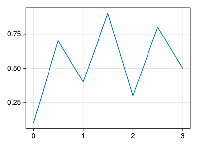 | **two lines cycle**<br>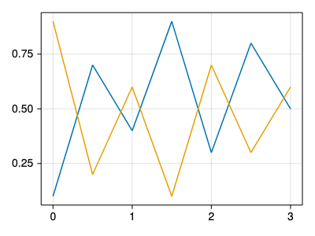 | **thick red line**<br>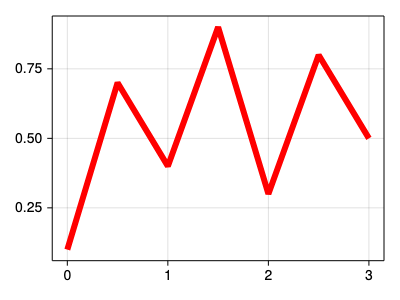 |
| **dashed line**<br>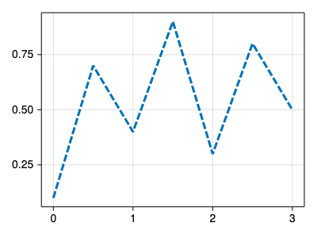 | **scatter default**<br>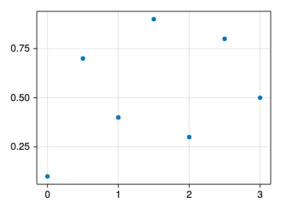 | **scatter sized rect**<br>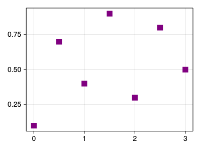 |
| **lines + scatter**<br>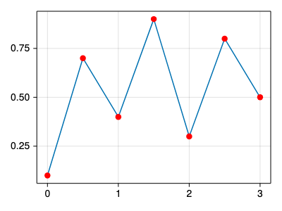 | **barplot**<br>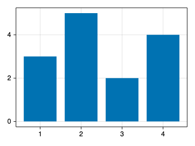 | **barplot negative**<br>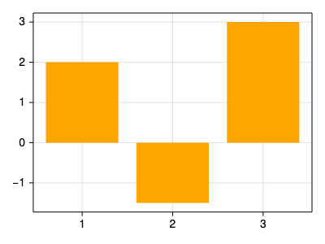 |
| **heatmap viridis**<br>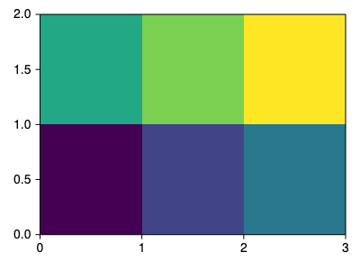 | **image primaries**<br>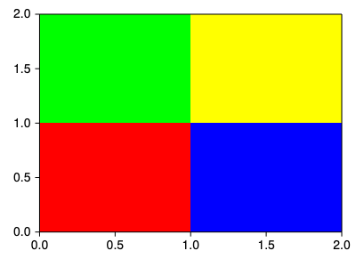 | **titles and labels**<br>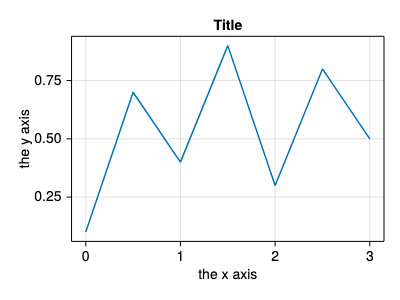 |
| **2x2 grid**<br>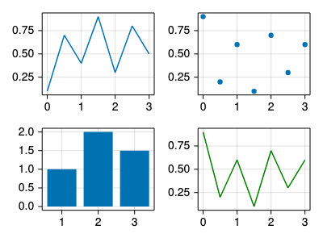 | **axis: hidden decorations + spines**<br>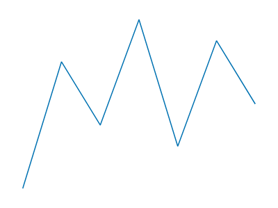 | **axis: minorgrid + bold title + subtitle**<br>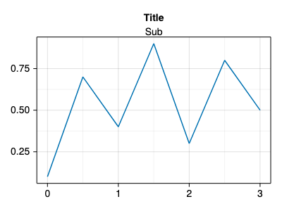 |
| **legend: axislegend rt**<br>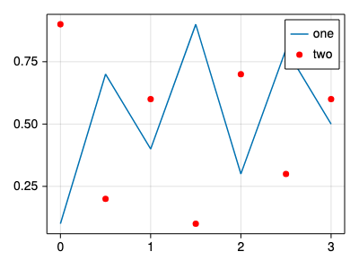 | **colorbar: heatmap-linked vertical**<br>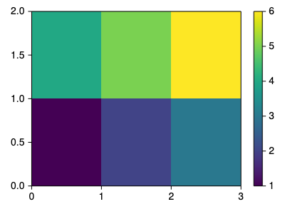 | **layout: span + relative colsize**<br>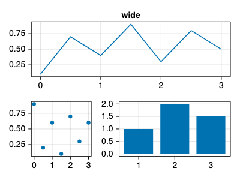 |
| **wave-1 annotations**<br>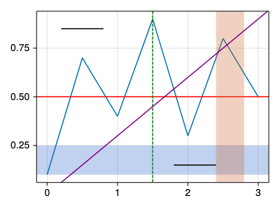 | **scatterlines**<br>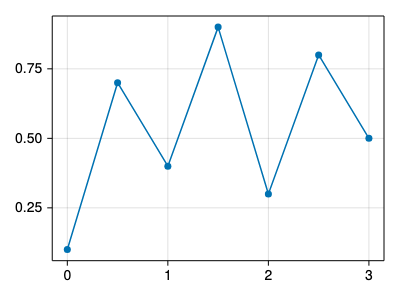 | **stairs pre**<br>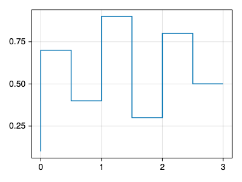 |
| **hist 8 bins**<br>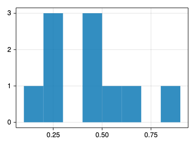 | **stem + errorbars**<br>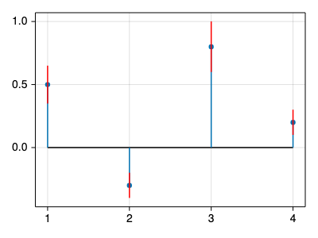 | **pie**<br>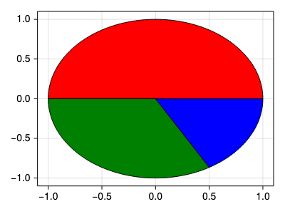 |
| **boxplot**<br>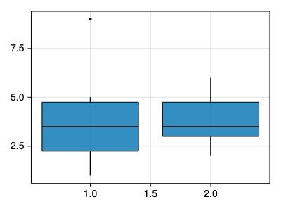 | **violin**<br>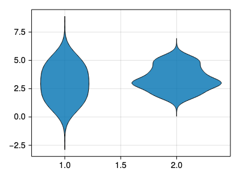 | **grouped + stacked bars**<br>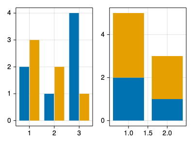 |
| **crossbar + waterfall**<br>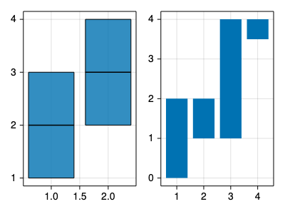 | **series**<br>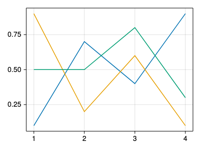 | **contour**<br>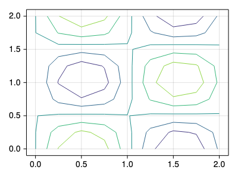 |
| **band**<br>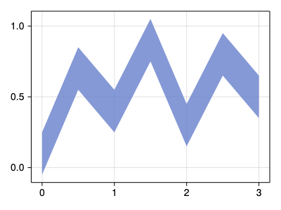 | **density**<br>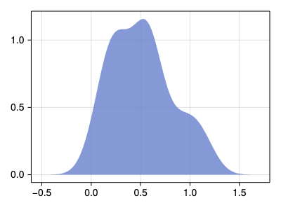 |  |
<!-- GALLERY:END -->

## Status

Pre-alpha, under active construction. The build plan and story ledger live in the parent
workspace (`WASMMAKIE_PLAN.md`). Makie pin: 0.24.11 / CairoMakie 0.15.11.

## Packages

| package | what | depends on |
|---|---|---|
| `WasmMakie` (root) | wasm-compilable core + draw layer + embedding contract | stdlib only |
| `CanvasMakie/` | true Makie backend (host-side), reference-suite runner | Makie, WasmMakie |

## License

MIT. Vendored code is from MIT-licensed sources (Makie.jl and its ecosystem); see VENDORED.md.
